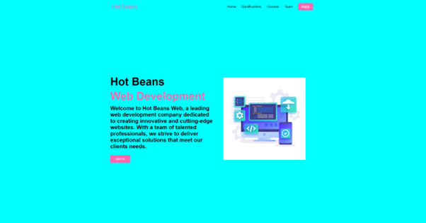
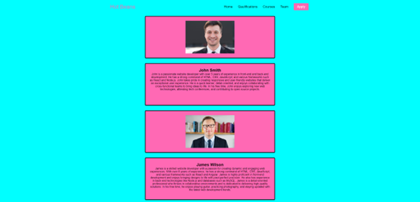
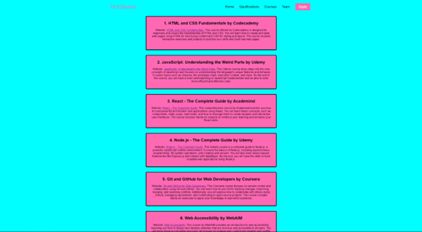

# 🌐 Company Promotion Website

This is a promotional website built for a fictional tech company to attract prospective employees. The site was developed as part of a BTEC Level 3 IT unit on website development and includes a multi-page layout, interactive navigation, and a responsive design.

## 📌 Features

- Multi-page HTML structure (Home, About Us, Benefits, Careers)
- Embedded video showcasing company culture
- Internal links and anchors for smooth scrolling
- Hover and transition effects using CSS
- Form with validation for job enquiries
- Fully responsive layout for desktop and mobile

## 🛠️ Tools & Technologies Used

- HTML5
- CSS3
- JavaScript (basic interactivity)
- Visual Studio Code (editor)
- GitHub Pages (for hosting, optional)

## 📸 Screenshots

## 📁 Notes

This site was developed as part of the **Website Development** unit in the BTEC Level 3 IT course (2022–2024). It focused on usability, navigation, design consistency, and promoting a business to potential employees.
